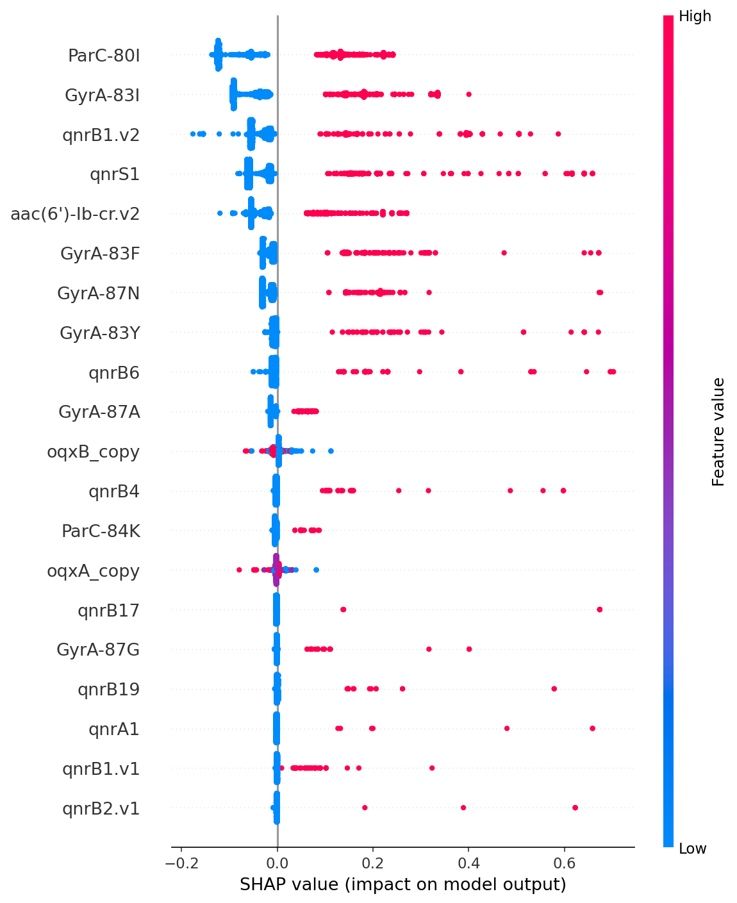
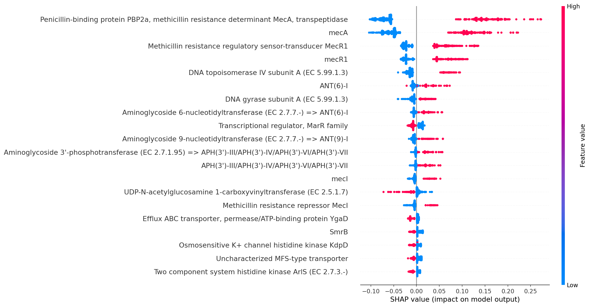
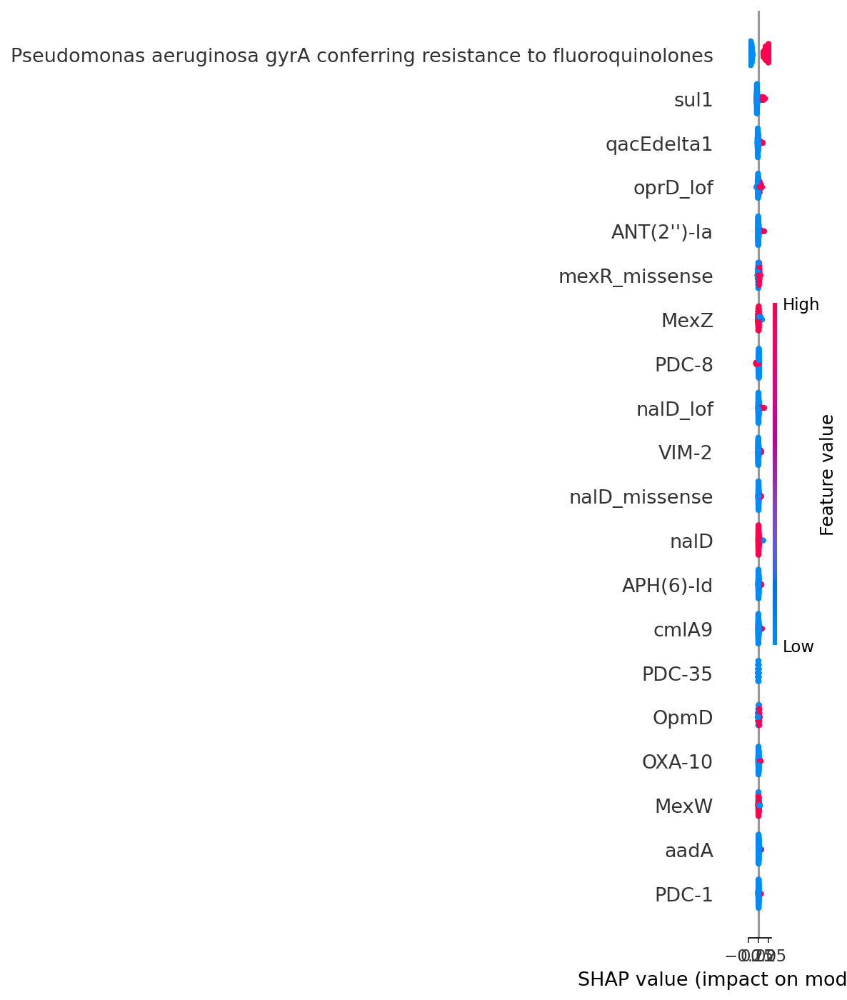
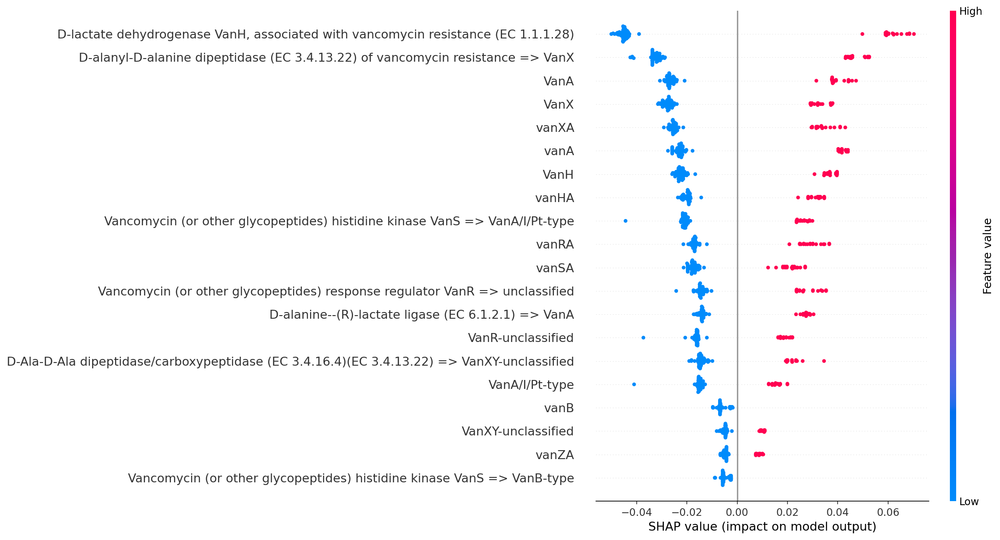
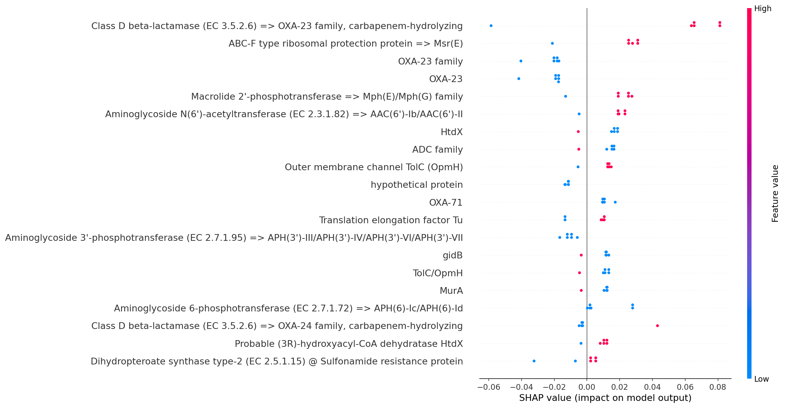
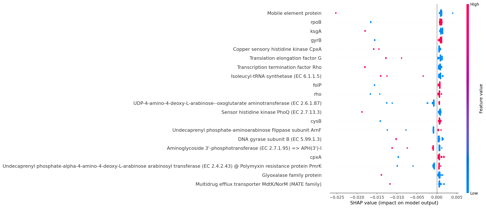

# PathTwin

**A computational pipeline for antimicrobial resistance profiling across the ESKAPE pathogens, built on real public genomic, structural, and phenotype data. Every headline number here was checked against a real file before being reported.**

## Overview

The ESKAPE pathogens (*Enterococcus faecium, Staphylococcus aureus,
Klebsiella pneumoniae, Acinetobacter baumannii, Pseudomonas aeruginosa,
Enterobacter* spp.) are the six bacteria most responsible for
hard-to-treat, antibiotic-resistant infections worldwide. PathTwin asks
a connected set of questions about how these organisms resist
antibiotics: which genes they carry, whether those genes' proteins
actually bind candidate drugs the way structural biology predicts,
what a given resistance mutation does mechanically, whether the
resulting phenotype is machine-learning-predictable from genomic data
alone, and whether a bacterium's own CRISPR-Cas immune system
influences how much resistance DNA it picks up. It uses the same
public databases and structural biology tools a wet-lab-adjacent
computational group would actually reach for.

Every structure, accession, and literature claim used here was checked
against its primary source. Every result is reported and compared with the literature.
Discrepancies identified during the analysis, including errors in ligand identification, docking-box placement, or database integrity, were formally documented and incorporated into the corresponding methodological corrections.
[`METHODOLOGY.md`](METHODOLOGY.md).


## The six stages

| Stage | Question it answers | Core tool |
|---|---|---|
| 1. Resistance gene profiling | Which known resistance genes does this genome carry? | RGI / CARD |
| 2. Molecular docking validation | Does a candidate drug actually bind the resistance protein's structure the way it should? | AutoDock Vina |
| 3. Comparative mutation tracking | What resistance-relevant mutations distinguish two real strains? | snippy + CARD |
| 4. Mutation-impact simulation | Does a specific mutation destabilize the protein or change drug binding? | FoldX + Vina |
| 5. ML resistance-phenotype classifiers | Can resistance phenotype be predicted from genomic features alone? | Random Forest / XGBoost |
| 6. CRISPR-Cas / AMR co-occurrence | Does a working CRISPR-Cas system reduce acquired resistance-gene burden? | CRISPRCasTyper |

Each stage runs across some or all of the 6 ESKAPE species. Coverage
varies by stage and is shown exactly, cell by cell, on the dashboard's
Overview page (see below).

## Headline validated results

- **FosA / fosfomycin docking**: the computed binding pose lands
  **0.15 Å** (centroid) from the real, independently solved crystal
  structure's ligand position, essentially reproducing the real bound
  geometry.
- **E. faecium vancomycin resistance classifier**: every one of the top
  15 SHAP-important features the model relies on is a real van-cluster
  gene. The model learned the correct biological mechanism.
- **A. baumannii, CRISPR-Cas vs. acquired-resistance burden**: excluding
  a single dominant clone that was skewing the population gives p = 7.1
  × 10⁻⁸ for a real, strong effect. A naive population-wide test without
  that exclusion missed it entirely.
- **P. aeruginosa, CRISPR-Cas vs. acquired-resistance burden**, at
  population scale (n=1020 genomes): p = 2.9 × 10⁻¹², supporting the
  literature's inverse-correlation hypothesis at real statistical power.
- **K. pneumoniae carbapenem-resistance classifier**: 96–98% accuracy,
  verified not to be inflated by clonal or study-batch leakage via
  grouped cross-validation.

**Validation of Docking-Based Screening Performance.** Pose-reproduction accuracy addresses whether the docking protocol can reproduce experimentally observed ligand poses, whereas screening accuracy evaluates whether the pipeline can distinguish active compounds from similarly sized decoy molecules. To assess this distinction, screening performance was evaluated across all eight validated docking targets using the active-vs-decoy AUC-ROC benchmark following DUD-E methodology. Bootstrap confidence intervals were calculated to quantify uncertainty associated with the sample size and to determine whether the observed discrimination differed from chance.

**Active–Decoy Discrimination Performance.** Across the eight validated targets, two showed AUC values that were
statistically distinguishable from chance based on the bootstrap confidence
intervals. One demonstrated positive discrimination (AUC = 0.90), while the
other showed discrimination below chance (AUC = 0.30). The remaining six
targets were not statistically distinguishable from chance at the evaluated
sample size. During the validation process, the docking box for one target
was identified as being mis-centered by approximately 13 Å and was
subsequently corrected. The corrected configuration improved the
corresponding screening performance, but did not substantially change its
pose-reproduction accuracy. These results provide the current empirical
assessment of the screening performance and interpretability of the docking
scores within this pipeline.

Full details are provided in `METHODOLOGY.md` under
"Docking accuracy validation" and "SHV-1 box correction" in Stage 2.

## Results

SHAP summary plots for the Stage 5 resistance-phenotype classifiers,
showing which genomic features drive each model's predictions:

| K. pneumoniae (carbapenem) | S. aureus (oxacillin) |
|---|---|
|  |  |

| P. aeruginosa (fluoroquinolone) | E. faecium (vancomycin) |
|---|---|
|  |  |

| A. baumannii (carbapenem) | E. cloacae (ESC) |
|---|---|
|  |  |

### Key metrics

| Metric | Value | Detail |
|---|---|---|
| FosA/fosfomycin docking pose deviation from crystal | 0.15 Å | centroid-to-centroid vs. PDB 5V3D |
| Docking targets discriminating drug from decoy (of 8) | 2/8 | bootstrap 95% CI excludes chance |
| K. pneumoniae carbapenem classifier accuracy | 96.1–98.2% | random / ST-grouped / study-grouped splits |
| E. faecium vancomycin classifier, top-15 SHAP features that are real van-cluster genes | 15/15 | VanH, VanX, VanA, VanR, VanS |
| A. baumannii CRISPR-Cas vs. resistance burden | p = 7.09 × 10⁻⁸ | Mann-Whitney, dominant clone excluded, n=382 |
| P. aeruginosa CRISPR-Cas vs. resistance burden | p = 2.94 × 10⁻¹² | Mann-Whitney, population-wide, n=1020 |

Full metrics table with per-species breakdowns and source files:
[`results/metrics.md`](results/metrics.md).

## Explore the results

```bash
mamba activate pathtwin
streamlit run dashboard/app.py
```

The dashboard runs at `localhost:8501`. Every number on every page is
parsed live from a real file under `results/`. Nothing is computed by
the dashboard itself, and a missing result shows as an explicit gap
rather than a silent omission. Start on the Overview page for the
6-stage × 6-species coverage matrix and headline metrics.

## Running the pipeline yourself

Requires **WSL2** (Ubuntu) if you're on Windows. Several core
dependencies (RGI's BLAST/DIAMOND/prodigal stack especially) aren't
built for native Windows.

```bash
mamba env create -f environment.yml
conda activate pathtwin
rgi auto_load --clean        # one-time CARD database setup (see below)
```

Stages 2, 3/6, and parts of Stage 5 use their own isolated conda
environments (`pathtwin-docking`, `pathtwin-crispr`/`pathtwin-snippy`).
Each has its own `envs/*.yml`; they were kept separate after one real
dependency conflict early on made a shared environment unworkable. Each
stage's script header names which environment it needs.

**One real setup gotcha worth knowing up front**: RGI needs
`rgi auto_load --clean`. The bare `rgi load` form has silently desynced
RGI's database twice during this project (documented in full under
"CARD database mis-load" in `DECISIONS_AND_LIMITATIONS.md`).

## Repository layout

```
scripts/      pipeline code, one script (or small family) per task
dashboard/    the Streamlit results viewer
config/       reference genome accessions, docking box definitions
envs/         conda environment definitions (per-stage, isolated)
environment.yml   primary "pathtwin" environment (Stage 1 + 5), root copy of envs/pathtwin.yml
results/      SHAP plots and metrics.md tracked here; the full raw output tree is regenerable and gitignored
data/         inputs (genomes, structures), not tracked in git, regenerable from public sources
```

## Full rigor and honest limitations

This README states results; it doesn't reconstruct how they were
produced. **[`DECISIONS_AND_LIMITATIONS.md`](DECISIONS_AND_LIMITATIONS.md)**
is the complete record: every structure discrepancy caught, every tool
limitation hit and how it was handled, every ambiguous or negative
result, and the reasoning behind every methodological choice with a real
tradeoff. If a number in this README surprises you, that file explains
why. For the full chronological build narrative, see
[`BUILD_LOG.md`](BUILD_LOG.md).

## License

MIT. See [`LICENSE`](LICENSE).
